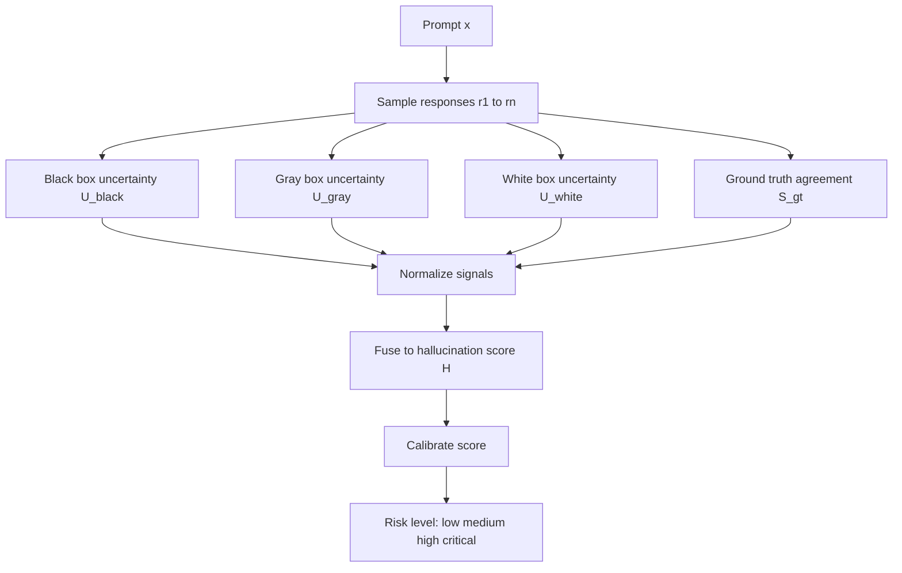

# Hallucination Detection in LLMs
### A Mathematical, Multi-Signal Reliability Framework

A mathematically grounded framework to estimate hallucination risk in LLM outputs using black-box, gray-box, white-box, and reference-agreement signals.

---

## Visual Overview

> Put images under `docs/assets/`.

---

## End to End Flow

---

## 1) Formal Problem Statement

Given:
- prompt \(x\),
- sampled responses \(R = \{r_1, \dots, r_n\}\),
- optional token probabilities/logits,
- optional ground truth \(g\),

estimate hallucination risk:

$$
H(x) \in [0,1]
$$

Interpretation:
- \(H(x)\approx 0\): reliable behavior
- \(H(x)\approx 1\): high hallucination risk

---

## 2) Black Box Uncertainty

Only output samples are required.

Empirical response distribution:

$$
\hat{p}(r)=\frac{\mathrm{count}(r)}{n}
$$

Response entropy:

$$
U_{\mathrm{black}}=-\sum_{r\in R_{\mathrm{unique}}}\hat{p}(r)\log \hat{p}(r)
$$

Normalized form:

$$
\tilde{U}_{\mathrm{black}}=
\frac{U_{\mathrm{black}}}{\log\left(|R_{\mathrm{unique}}|\right)+\varepsilon}
$$

High entropy implies low consistency.

---

## 3) Gray Box Uncertainty

Uses token log probabilities.

For \(r_i=(w_1,\dots,w_T)\):

$$
\log P(r_i \mid x)=\sum_{t=1}^{T}\log P(w_t \mid w_{1:t-1},x)
$$

Average token negative log likelihood:

$$
\mathrm{NLL}(r_i)=
-\frac{1}{T}\sum_{t=1}^{T}\log P(w_t \mid w_{1:t-1},x)
$$

Perplexity:

$$
\mathrm{PPL}(r_i)=\exp(\mathrm{NLL}(r_i))
$$

Confidence proxy:

$$
C_{\mathrm{gray}}(r_i)=\exp(-\mathrm{NLL}(r_i))
$$

Aggregate uncertainty:

$$
U_{\mathrm{gray}}=1-\frac{1}{n}\sum_{i=1}^{n}C_{\mathrm{gray}}(r_i)
$$

---

## 4) White Box Uncertainty

Uses logits/probability vectors.

Token probabilities from logits \(z_{t,k}\):

$$
p_t(k)=\frac{\exp(z_{t,k})}{\sum_j \exp(z_{t,j})}
$$

Token entropy:

$$
H_t=-\sum_k p_t(k)\log p_t(k)
$$

Sequence uncertainty:

$$
U_{\mathrm{white}}=\frac{1}{T}\sum_{t=1}^{T}H_t
$$

Optional margin confidence:

$$
m_t=p_t(k_{(1)})-p_t(k_{(2)})
$$

Smaller margin means higher ambiguity.

---

## 5) Ground Truth Agreement

For response \(r_i\) and reference \(g\):
- structural similarity \(S_{\mathrm{str}}(r_i,g)\in[0,1]\),
- keyword overlap \(S_{\mathrm{kw}}(r_i,g)\in[0,1]\).

Mean similarities:

$$
\bar{S}_{\mathrm{str}}=\frac{1}{n}\sum_{i=1}^{n}S_{\mathrm{str}}(r_i,g)
$$

$$
\bar{S}_{\mathrm{kw}}=\frac{1}{n}\sum_{i=1}^{n}S_{\mathrm{kw}}(r_i,g)
$$

Combined agreement:

$$
S_{\mathrm{gt}}=\alpha\bar{S}_{\mathrm{str}}+(1-\alpha)\bar{S}_{\mathrm{kw}},\quad \alpha\in[0,1]
$$

Semantic stability term:

$$
\mathrm{Var}_{\mathrm{sem}}=
\frac{1}{n}\sum_{i=1}^{n}\left(S_{\mathrm{str}}(r_i,g)-\bar{S}_{\mathrm{str}}\right)^2
$$

---

## 6) Feature Vector and Normalization

Signal vector:

$$
\mathbf{z}=
\left(
U_{\mathrm{black}},
U_{\mathrm{gray}},
U_{\mathrm{white}},
S_{\mathrm{gt}},
\mathrm{Var}_{\mathrm{sem}}
\right)
$$

Normalization:

$$
\tilde{\mathbf{z}}=\mathcal{N}(\mathbf{z})
$$

\(\mathcal{N}\) can be min-max, z-score, or robust scaling.

---

## 7) Fusion to Hallucination Score

Weighted fusion:

$$
H(x)=\sigma\left(
w_b\tilde{U}_{\mathrm{black}}
+w_g\tilde{U}_{\mathrm{gray}}
+w_w\tilde{U}_{\mathrm{white}}
-w_s\tilde{S}_{\mathrm{gt}}
+w_v\widetilde{\mathrm{Var}}_{\mathrm{sem}}
+b
\right)
$$

with nonnegative weights:

$$
w_b,w_g,w_w,w_s,w_v \ge 0
$$

Sigmoid:

$$
\sigma(t)=\frac{1}{1+\exp(-t)}
$$

---

## 8) Risk Bands

Let \(0\le\tau_1<\tau_2<\tau_3\le1\).

- LOW if \(H(x)<\tau_1\)
- MEDIUM if \(\tau_1\le H(x)<\tau_2\)
- HIGH if \(\tau_2\le H(x)<\tau_3\)
- CRITICAL if \(H(x)\ge\tau_3\)

---

## 9) Statistical Validation

For predicted scores \(s_i\) and labels \(y_i\in\{0,1\}\):

Pearson:

$$
\rho_P=
\frac{\sum_i (s_i-\bar{s})(y_i-\bar{y})}
{\sqrt{\sum_i (s_i-\bar{s})^2}\sqrt{\sum_i (y_i-\bar{y})^2}}
$$

Spearman:

$$
\rho_S=\rho_P\left(\mathrm{rank}(s),\mathrm{rank}(y)\right)
$$

Thresholded prediction:

$$
\hat{y}_i(\tau)=\mathbf{1}[s_i\ge\tau]
$$

Rates:

$$
\mathrm{TPR}=\frac{\mathrm{TP}}{\mathrm{TP}+\mathrm{FN}},\quad
\mathrm{FPR}=\frac{\mathrm{FP}}{\mathrm{FP}+\mathrm{TN}}
$$

$$
\mathrm{Precision}=\frac{\mathrm{TP}}{\mathrm{TP}+\mathrm{FP}},\quad
\mathrm{Recall}=\frac{\mathrm{TP}}{\mathrm{TP}+\mathrm{FN}}
$$

Area metrics:

$$
\mathrm{AUROC}=\int_0^1 \mathrm{TPR}(u)\,d(\mathrm{FPR}(u))
$$

$$
\mathrm{PRAUC}=\int_0^1 \mathrm{Precision}(r)\,d(\mathrm{Recall}(r))
$$

---

## 10) Calibration

Expected Calibration Error:

$$
\mathrm{ECE}=
\sum_{m=1}^{M}\frac{|B_m|}{N}
\left|\mathrm{acc}(B_m)-\mathrm{conf}(B_m)\right|
$$

Brier score:

$$
\mathrm{Brier}=\frac{1}{N}\sum_{i=1}^{N}(s_i-y_i)^2
$$

Lower ECE and Brier imply more reliable probabilities.

---

## 11) Ablation Strategy

To quantify contribution of each signal family:

$$
\Delta_j=\mathcal{M}(\text{full model})-\mathcal{M}(\text{without signal }j)
$$

where \(\mathcal{M}\in\{\mathrm{AUROC},\mathrm{PRAUC},-\mathrm{ECE}\}\).

---

## 12) Complexity Profile

Let \(n\): number of responses, \(T\): average sequence length, \(|V|\): vocabulary size.

- black-box entropy: \(O(n)\)
- gray-box aggregation: \(O(nT)\)
- white-box entropy: \(O(nT|V|)\)
- similarity aggregation: typically \(O(nT)\) to \(O(nT\log T)\)

---

## 13) Practical Interpretation

- High \(U_{\mathrm{black}}\) and high \(U_{\mathrm{white}}\): unstable generation + uncertain token decisions.
- Low \(S_{\mathrm{gt}}\): weak factual alignment to reference.
- High \(H(x)\): require stronger verification or human review.
- Medium \(H(x)\): apply fallback checks before final answer.

---

## 14) Visual Assets Checklist

Include these files:

- `docs/assets/01_system_overview.png`
- `docs/assets/02_uncertainty_layers.png`
- `docs/assets/03_fusion_thresholds.png`
- `docs/assets/04_roc_pr.png`
- `docs/assets/05_calibration.png`

---

## 15) Repository Scope

- Multi-signal uncertainty decomposition
- Mathematically defined fusion and thresholding
- Correlation, ranking, discrimination, calibration analysis
- Multilingual orientation (TR/EN settings)

---

## License

MIT

---

## Citation

If used in research or production, please cite this repository and include the project URL.
